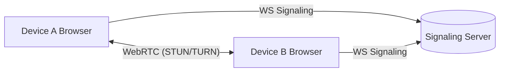

# WebDrop – P2P Beam Between Any Two Browsers

A dead-simple, viral utility: open on two devices → scan a QR → drag a file → it beams device-to-device via WebRTC. No account. No server-side file storage.

## Product Pillars
- **Frictionless**: One screen, QR handshake, instant transfer.
- **Private by default**: RTCDataChannel only. No file persists server-side.
- **Resilient**: STUN first, **TURN fallback** if P2P fails.
- **Ephemeral**: Rooms auto-expire after 5 minutes or manual end.
- **Trustworthy**: Clear permissions, visible timer, explicit disconnect.

## KPIs
- **First-transfer success rate**
- **Time-to-first-transfer (TTFT)**
- **P2P vs TURN ratio**
- **Drop-off before connect**

---

## Architecture Overview



- **Frontend**: Next.js + TypeScript (strict). Single-page flow with routes for "host" and "join".
- **Signaling**: Node `ws` server for SDP/ICE exchange. Ephemeral in-memory rooms with TTL.
- **WebRTC**: STUN first; `TURN_URL`, `TURN_USERNAME`, `TURN_PASSWORD` envs enable TURN fallback.
- **Observability**: Sentry (opt-in via DSN), structured logs, basic healthcheck.
- **Security & Abuse Mitigation**: Random room IDs + one-time join tokens, IP rate limiting on room create/join, CORS hardening.

---

## Data Flow (Happy Path)
1. Host opens `/host` → creates a **roomId** and **joinToken** via WS → renders **QR** containing a join URL with token.
2. Guest scans QR → opens `/join/:roomId?token=...` → WS joins the room.
3. Signaling server relays SDP/ICE between peers.
4. WebRTC `RTCDataChannel` opens.
5. Host drags files or pastes text → chunks streamed to Guest with progress.
6. Either side can end the room → WS closes → room TTL cleanup.

### Failure/Recovery Paths
- If direct P2P fails after timeout → retry ICE with **TURN** if configured.
- If WS unavailable → offer **manual copy/paste** of SDP as last resort (non-default UI panel).
- If TURN not configured → inform user P2P-only limitations and suggest same-network retry.

---

## Signaling Protocol (WS)
- Path: `ws://<host>:<port>/ws`
- Messages are JSON with `type` and `payload` validated via `zod`.

Types:
- `create_room` → server responds `room_created { roomId, joinToken, expiresAt }`
- `join_room { roomId, token }` → server validates token → responds `room_joined | error`
- `signal { roomId, data }` → relays SDP/ICE to the other peer
- `end_room { roomId }` → invalidates and notifies peer
- `heartbeat { roomId }` → optional keepalive to extend room during active transfer

Server behavior:
- Rooms stored in-memory: `{ roomId, hostSocketId, guestSocketId?, joinToken, expiresAt }`
- 5-minute TTL. Cleanup on expiry or on `end_room`.
- Rate limit: e.g., 30 create/join per IP per 10 minutes (token bucket).

---

## Security Model
- **No file storage**: All data over RTCDataChannel. Server never receives file bytes.
- **Randomness**: `nanoid(20)` for `roomId`, `nanoid(24)` for `joinToken`.
- **One-time token**: Token is consumed on first valid join.
- **Origin checks**: Restrictive CORS for WS/API.
- **Headers**: Security headers on Next.js responses.
- **DoS controls**: IP rate limiting & message size caps on WS.

---

## UI/UX
- **Home**: Choose `Send` or `Receive`.
- **Send (Host)**: Shows QR, session timer, drag-and-drop area once connected. Progress bars per file. Cancel buttons.
- **Receive (Guest)**: On connect, displays incoming items, with per-file accept/save, and status. On mobile, emphasizes QR scan entry.
- **States**: `waiting`, `connecting`, `connected`, `transferring`, `done`, `expired`.
- **A11y**: Keyboard accessible, ARIA labels, color-contrast safe.

---

## Directory Structure (after scaffold)
```
webdrop/
  server/
    signaling.ts          # WS server (rooms, rate limiting, cleanup)
  src/
    app/
      page.tsx            # Home (choose send/receive)
      host/page.tsx       # Host flow (QR + send)
      join/[roomId]/page.tsx  # Guest flow (join + receive)
    lib/
      webrtc.ts           # createPeer, channel events, TURN fallback
      signaling.ts        # ws client helpers
      schemas.ts          # zod schemas for messages
      rateLimit.ts        # simple token-bucket for API if needed
    components/
      QrCard.tsx
      DropZone.tsx
      ProgressList.tsx
      Timer.tsx
  .env.local.example
  package.json
  README.md
  PLAN.md
```

---

## Environment Variables
- `NEXT_PUBLIC_SIGNALING_URL` – e.g., `wss://signaling.webdrop.app/ws`
- `PORT` – signaling server port (default 8080)
- `STUN_URLS` – optional, comma-separated; default to public Google STUN
- `TURN_URL` – optional; e.g., `turn:turn.example.com:3478`
- `TURN_USERNAME`, `TURN_PASSWORD`
- `SENTRY_DSN` – optional

`.env.local.example` will include placeholders; runtime must handle missing TURN gracefully.

---

## Tech Choices & Fallbacks
- **Next.js + TS (strict)** for UI and static hosting
- **WS signaling** with `ws` library; in-memory store; can later move to Redis
- **WebRTC** via native `RTCPeerConnection`; `simple-peer` to reduce boilerplate if needed
- **Fallbacks**:
  - If TURN not provided → P2P best effort
  - If WS fails → manual signaling panel available behind toggle
  - Degraded read-only UI if signaling unreachable (show helpful guidance)

---

## Observability & Ops
- **Sentry** init (disabled until DSN set)
- **Structured logs** with timestamps and request IDs
- **Healthchecks**: `/api/health` (Next) and `/healthz` (signaling)
- **Blue/Green**: Two environments; traffic switch + instant rollback

---

## Security Checklist (MVP)
- Rate limit WS room create/join
- Validate all messages with `zod`
- Cap message sizes; drop abusive sockets
- Use HTTPS/WSS in production; HSTS on web
- Secrets via env only; no hardcoding

---

## Top-Down Implementation Checklist
1. Repo scaffold
   - Next.js app `webdrop` (TS strict, ESLint, Prettier)
   - Add deps: `ws`, `zod`, `nanoid`, `react-qr-code`, `@sentry/nextjs`
   - Scripts to run Next app and signaling server with `concurrently`

2. Signaling server (server/signaling.ts)
   - WS endpoint `/ws`
   - Room lifecycle (create/join/end) + TTL cleanup
   - Message validation (zod)
   - IP rate limiting & size caps
   - Healthcheck `/healthz`

3. Client signaling lib (src/lib/signaling.ts)
   - Connect, createRoom, joinRoom, send/receive `signal` messages
   - Auto-reconnect/backoff

4. WebRTC lib (src/lib/webrtc.ts)
   - Create peer with STUN/TURN
   - DataChannel events (open, message, progress, error)
   - Chunking for large files, backpressure handling

5. UI
   - Home: choose Send/Receive
   - Host page: QR display, timer, after connect show DropZone + ProgressList
   - Join page: auto-join via URL, receive UI with per-item controls
   - ErrorBoundary + toasts

6. Observability & security
   - Sentry init (conditional)
   - Security headers
   - Rate limiting middleware (if any Next API)

7.## Deployment (Render)
- Web app → Render Web Service (Node): SSR Next.js with `npm run build` and `npm start`.
- Signaling server → Render Web Service (Node or Docker). Expose port `PORT` and path `/ws` for WebSockets.
- TURN → managed provider (Twilio/Xirsys/Metered) or self-hosted coturn.

### Render Setup
- Services:
  - `webdrop-web` (Type: Web Service)
    - Build command: `npm ci && npm run build`
    - Start command: `npm start`
    - Env Vars: `NEXT_PUBLIC_SIGNALING_URL=wss://<signal-host>/ws`, optional Sentry and TURN `NEXT_PUBLIC_*`
  - `webdrop-signal` (Type: Web Service)
    - Option A (Node):
      - Build: `npm ci && npm run build:signaling`
      - Start: `node server-dist/signaling.js`
    - Option B (Docker): point to `server/Dockerfile`
    - Env Vars: `PORT=8080`, TURN credentials if you prefer server-provided ICE
    - Health check path: `/healthz`

### Render Blue/Green
- Create two signaling services (e.g., `webdrop-signal-blue`, `webdrop-signal-green`).
- Point `webdrop-web` `NEXT_PUBLIC_SIGNALING_URL` to the active one.
- To promote: deploy new version to the inactive; update `NEXT_PUBLIC_SIGNALING_URL` and redeploy web. Roll back by swapping back.

### Networking & WebSockets on Render
- Ensure "Enable WebSocket support" is on for the signaling service.
- Use TLS `wss://` for public endpoints; ensure CSP `connect-src` allows your domain.

### Environment Variables (Render)
- Web (`webdrop-web`):
  - `NEXT_PUBLIC_SIGNALING_URL=wss://<signal-host>/ws`
  - Optional client-side: `NEXT_PUBLIC_TURN_URL`, `NEXT_PUBLIC_TURN_USERNAME`, `NEXT_PUBLIC_TURN_PASSWORD`
  - Optional: `NEXT_PUBLIC_SENTRY_DSN`
- Signaling (`webdrop-signal`):
  - `PORT=8080`
  - Optional TURN (if injecting ICE servers centrally later)

---

## Testing Strategy
- **Unit**: zod schemas, room store, rate limiter
- **Integration**: WS create/join/end flows (supertest/ws harness)
- **Manual**: Two browsers + mobile device over LTE vs Wi-Fi; measure P2P vs TURN

---

## Future Enhancements (Post-MVP)
- Multiple recipients per room
- Optional end-to-end encryption key exchange UI (SRTP already protects media; data channel encrypted; UI key display for extra trust)
- Replay protection & signed invites
- Local network discovery (mDNS) where available
- Native wrappers (PWA or minimal mobile app) for background transfers

---

## Current Implementation Status (MVP)
- Frontend (Next.js + TS): Implemented home, host (QR, copy link, timer, dropzone, progress), join (auto-join, progress, save), manual signaling fallback panel, TURN notice banner.
- Signaling server (`server/signaling.ts`): Implemented WS `/ws`, room lifecycle, one-time join token, TTL cleanup, IP rate limiting, message size caps, `/healthz`, structured JSON logs.
- Client libs: `src/lib/schemas.ts`, `src/lib/signaling.ts` (create/join/signal + heartbeat + end), `src/lib/webrtc.ts` (STUN/TURN config, data channel helpers).
- Security: `next.config.ts` CSP allowing `ws:`/`wss:`, security headers. No server-side file storage.
- Observability: Optional Sentry init (client) mounted in layout (no-op unless DSN provided). Structured logs on signaling.
- Health: Next `/api/health`, signaling `/healthz`.
- Build & scripts: `package.json` dev/build/start wired for both app and signaling; `server/tsconfig.json` outputs to `server-dist/`.
- Containerization: `server/Dockerfile` builds and runs signaling (Node 20 Alpine).
- Docs: `README.md` (local), `DEPLOY.md` (Vercel + Fly.io, TURN, blue/green).
- Starter script: `start.sh` kills ports and runs frontend on `3010` and backend on `8020` with `NEXT_PUBLIC_SIGNALING_URL` set.

## How to Run Locally (Ports 3010/8020)
```bash
cd webdrop
chmod +x start.sh
bash ./start.sh
# Frontend: http://localhost:3010
# Signaling health: http://localhost:8020/healthz
```

## Deployment Artifacts
- Next.js → Vercel (set `NEXT_PUBLIC_SIGNALING_URL` to public WSS)
- Signaling → Fly.io (or Node host) via `server/Dockerfile`, expose `/ws` and `/healthz`
- TURN: add `TURN_URL`, `TURN_USERNAME`, `TURN_PASSWORD` in envs (client auto-fallback)
- Blue/green: two signaling apps (blue/green) with DNS switch; Vercel supports instant rollback for web

## Remaining Tasks & Next Priorities
- Add lightweight connection retry/on-screen toasts for error states (client)
- Add `outputFileTracingRoot` to `next.config.ts` to silence inferred workspace warning in monorepo-like setups
- Add small UX polish: copy room code helper, clearer guidance when TURN absent (both host/join banners)
- Unit tests: zod schemas, signaling message validation, basic rate limiter tests
- Integration tests: create/join/end flows for signaling (ws harness)
- CI/CD: lint (ESLint), format (Prettier), type-check, and tests on PRs; Sentry DSN as secret
- Optional: deployment templates (Vercel/Fly env examples) as `.env.example.production`
- Optional: enhance chunking/backpressure metrics and transfer speed display
